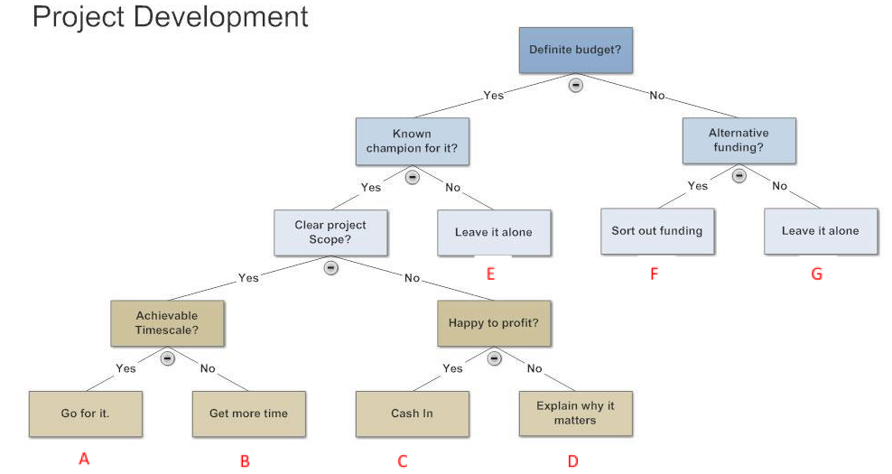
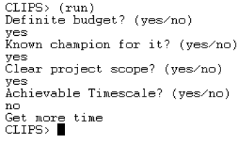
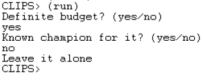
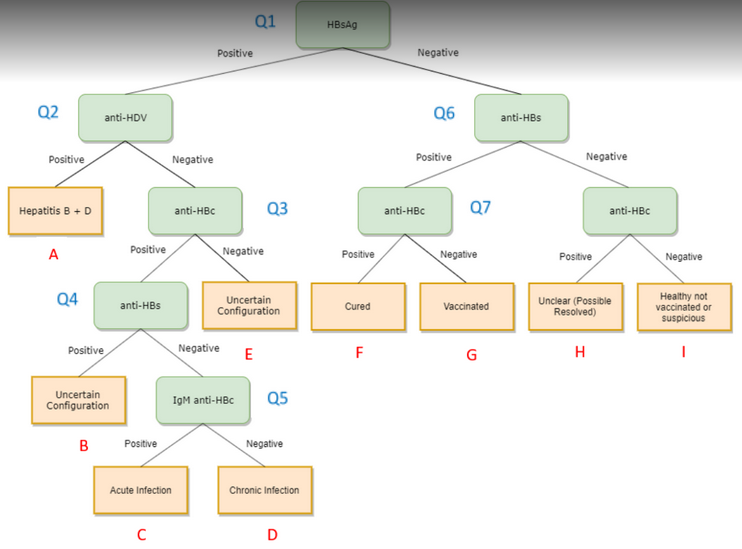

# Expert System
Table of Content
* [How to run](#Guideline)
* [Task I : Project Development](#ProjectDevelopment)
* [Task II: Medical Diagnosis](#MedicalDiagnosis)

<br/>

# Guideline
How to run the code? 
1. Make sure you have CLIPSIDE64 installed in your PC
2. Load the `.CL` file 
3. Select all lines
4. Press ctrl + k
5. Hit `(reset)` and `(run)` in the Dialog Window 
6. Hit `(clear)` to delete all rules and facts

<br/>

# ProjectDevelopment
A simple program built according to the decision tree below. Code can be found [here](https://github.com/Sins-Repo/ExpertSystem/blob/main/proj_dev.CLP) <br/><br/>


<br/>

### Sample output 
**Case B** <br/>


<br/>

**Case E** <br/>


<br/>

### Alternative
Not compulsory to include all the conditions
```
(defrule moretime
  (startup-budget yes)
  (known-champion yes)
  (clear-scope yes)
  (achievable-timescale no)
  =>
  (printout t "Get more time" crlf)
)
```

<br/>
<br/>

# MedicalDiagnosis
A program that performs Hepatitis B prediction. Code can be found [here](https://github.com/Sins-Repo/ExpertSystem/blob/main/med_diag.CLP) <br/><br/>


<br/>
